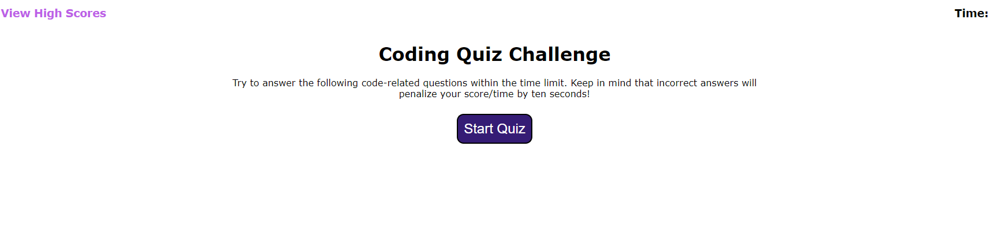
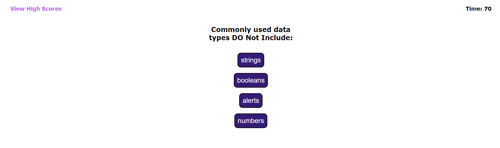
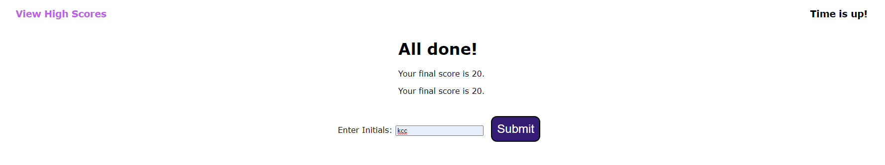

# Web APIs Challenge: Code Quiz

## Description

As a coding boot camp student,
I want to take a timed quiz on JavaScript fundamentals that stores high scores,
so that I can gauge my progress compared to my peers

## Installation

This was a long process of creating the HTML, CSS, and JavaScript to come up with a working Code Quiz.

## Usage

Coding assessments are an important part of the interview process for developers. In fact, employers often use them to filter out job candidates with a cut-off score. To help you prepare, we’ve developed a set of technical interview questions that you can answer throughout the course. The difficulty level of these questions will increase as you become a more proficient developer. If you take advantage of these opportunities to practice, you should be well-prepared to shine during the technical interview process toward the end of this course!

## URL's

Website URL:
https://arthur528.github.io/blu-pig-4/
GitHud:
https://github.com/Arthur528/blu-pig-4

## Pictures

## License

Please refer to the LICENSE in the repo.